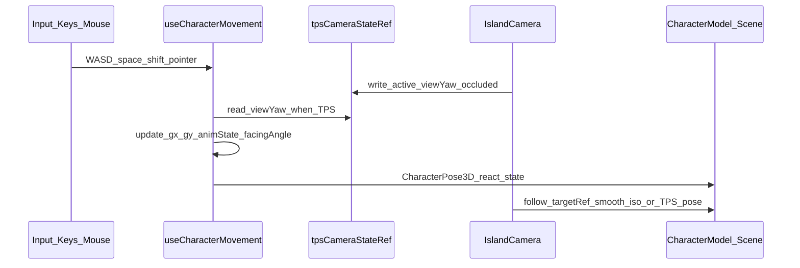

# Player Controller & Camera (Iso / TPS)

The **player** is not a single monolithic class: **`useCharacterMovement`** owns grid position, input, and animation state (`CharacterPose3D`), while **`IslandCamera`** owns orthographic isometric orbit vs. third-person perspective. They stay in sync via **`tpsCameraStateRef`** (`active`, `viewYaw`, `characterOccluded`). In **isometric** mode the user orbits and zooms an ortho camera; past a zoom threshold they enter **TPS**, where WASD (and optional mouse-ground aim) move relative to camera yaw until wheel-zoom exits. **`CharacterModel`** only renders the pose; **`OccludedPlayerMarker`** shows an on-top ring when TPS line-of-sight to the character is blocked (no camera pull-through).

## Input → Pose → Camera (sequence)

## Source map

| Concern | File |
|--------|------|
| Pose & movement | `src/game/three/useCharacterMovement.ts` |
| Iso / TPS camera | `src/game/three/IslandCamera.tsx` |
| Wiring | `src/game/three/IslandScene.tsx` |
| Character mesh | `src/game/three/CharacterModel.tsx` |
| Occlusion hint | `src/game/three/OccludedPlayerMarker.tsx` |
