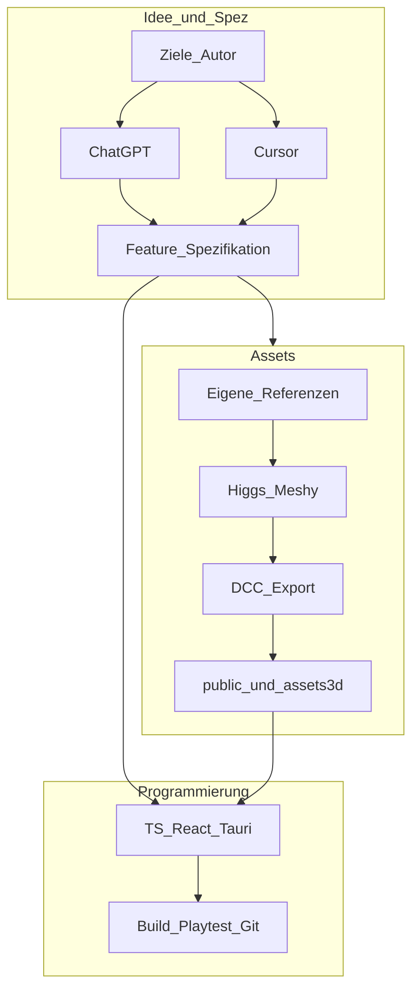
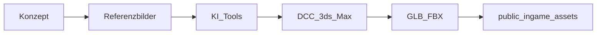
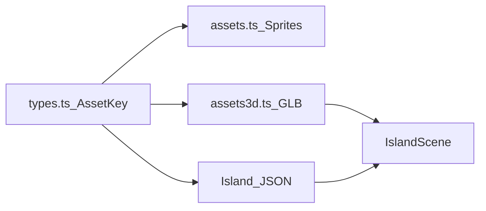

# Skyhaven — Portfolio-Kontext (Deutsch)

Repo-gestützte Grundlage für Bewerbungsmappe oder Studio-Pitches. **Hinweis:** Die Spiel-UI im Produkt ist absichtlich auf **Englisch**; dieses Dokument ist die **deutsche** Projektdokumentation.

---

## Kurzfassung für Studios

**Skyhaven** ist ein **Desktop-Widget-Spiel** (kleines Fenster): eine **isometrische schwebende Insel** als **Three.js**-Szene (React Three Fiber, Drei), darüber **React-UI** (HUD, Sidebar, Overlays), verpackt mit **Tauri 2**. Produktname in Tauri: `skyhaven/src-tauri/tauri.conf.json`.

Kernidee: **Produktivitäts- / Focus-Metapher** — Sessions mit Countdown, Status-Tag, Insel als „Zuhause“, POIs (z. B. Mine, Farm), erweitert um Progression, Inventar, Planer, Charaktere, Audio.

**Architekturentscheidung:** Das Projekt wuchs von einem **2D-Sprite-/Iso-Kern** (Manifest, Sortierung, Springs: `src/game/assets.ts`, `src/game/iso.ts`, `src/game/useSkyhavenLoop.ts`, `src/game/spring.ts`) zu einem **3D-Insel-Renderer** (`src/game/three/IslandScene.tsx`, Tile-GLBs in `src/game/three/assets3d.ts`). **Begründung:** mehr visuelle Tiefe, konsistente Beleuchtung inkl. Tag-Nacht, bessere Skalierbarkeit für Props und Charaktere; die Insel bleibt **datengetrieben** (JSON, u. a. `src/game/customIsland.ts`, Beispiele `src/game/island.mining.json`, `src/game/island.farming.json`).

---

## Verifizierte UI-Claims (Code-Stand)

Damit die Mappe **nicht überverkauft**:

| UI-Element | Implementierung |
|------------|-----------------|
| **Shop** (`src/ui/Sidebar.tsx`) | Einträge „Starter Pack“, „Boost Booster“, „Skin Crate“ — Klicks lösen nur Menü-SFX aus, **kein** Kauf/Gameplay. |
| **Achievements** (Main Menu) | Button „- Achievements“ ruft nur `playTapPrimary()` auf — **kein** separates Achievements-System im Sinne von Trophäen-UI. |
| **Profile**, **Daily Quests** | Öffnen echte Overlays (`onProfileOpen`, `onDailyQuestsOpen` → Planner). |

Formulierung für Studios: *„Shop und Achievements sind als UI-Rahmen angelegt; Economy bzw. Achievements-Logik sind noch ausbaubar.“*

---

## Zusammenarbeit mit KI (Kurztext für HR)

Ich arbeite **ideenreich und iterativ** mit **ChatGPT** (Konzept, Struktur, Recherche) und **Cursor** (repo-bezogene Umsetzung in TypeScript/React/Tauri). **Verantwortung** für Architektur, manuelle Tests, Annahmenprüfung und Git liegen bei mir; KI-Assistenten sind **Pair-Programming-Beschleuniger**, keine alleinigen Autoren. Jeder Merge basiert auf **nachvollziehbaren Diffs**, die ich aktiv prüfe.

---

## Rolle & Gesamtpipeline (Code + Art)

Skyhaven ist **menschlich geführt**: eigene Ideen und Referenzen; **Ausarbeitung** gemeinsam mit KI oder als strukturierte Ausformulierung der Vorgaben; **Umsetzung** im Editor mit Review und Playtest.

**Strang A — Programmierung:** Rohidee → ChatGPT/Cursor (Spez) → Änderungen im Repo → `npm run dev` / `npm run tauri dev` → Git → ggf. Markdown-Doku (z. B. [PLAYER_CAMERA_AND_CONTROLLER.md](PLAYER_CAMERA_AND_CONTROLLER.md)).

**Strang B — Assets:** Konzept → eigene Bilder/Referenzen → KI-Tools (z. B. **Higgs Field**, **Meshy** — im Pitch immer **offizielle Produktnamen**) → DCC (z. B. 3ds Max) → **GLB**/`FBX` → `public/ingame_assets/` → `src/game/types.ts`, `src/game/three/assets3d.ts`, ggf. `src/game/assets.ts`.

**Creative Ownership:** Auswahl, Stil, Maßstab im Grid und Integration im Engine-Stack liegen beim Menschen; KI verkürzt Iterationszyklen. **Third-party** (Musik, SFX, Schriften) separat nennen.

### Pipeline-Diagramm (Idee → Code & Art)

### Asset-Pipeline (Detail)

### Datenfluss Tiles / Szene

---

## Tech-Stack

| Bereich | Technologie | Im Repo |
|--------|-------------|---------|
| Shell | Tauri 2 | `package.json`, `src-tauri/` |
| UI | React 19, TypeScript, Vite 7 | `package.json` |
| 3D | three, R3F, drei, postprocessing | `package.json` |
| Kamera / Controller | Doku | [PLAYER_CAMERA_AND_CONTROLLER.md](PLAYER_CAMERA_AND_CONTROLLER.md) |

---

## Features & Systeme (Code-Inventar)

Zentrale Integration: `src/App.tsx` (Canvas, Persistenz, Overlays, Fenstermodi).

**Gameplay / Meta:** `session.ts` (Focus/Pomodoro, Key `skyhaven.focusSession.v1`), `progression.ts`, `resources.ts`, `inventory.ts`, `equipment.ts`, `dailyQuests.ts`, `actionStats.ts`, `profile.ts`, `playableCharacters.ts`, `poiActions.ts`.

**Welt & Darstellung:** `IslandScene.tsx`, `islandLighting.ts`, NPCs, `SkullyCompanion.tsx`, `useCharacterMovement.ts`, `IslandCamera.tsx`, `graphicsSettings.ts`.

**UI:** `Hud.tsx`, `ClockOverlay.tsx`, `StatusTag.tsx`, `Sidebar.tsx`, `DebugDock.tsx`, `planner/PlannerOverlay.tsx`, Character-/Dialog-/POI-Overlays unter `src/ui/`.

**Audio:** `useIslandMusic.ts`, `useWorldAmbience.ts`, `useMenuSfx.ts`, `playerFootstepSfx.ts`, `MagicTowerHoverSfx.tsx`, Assets unter `public/ingame_assets/`.

**Tooling:** `npm run match:island`, `npm run extract:char-frames`, `npm run capture:portfolio` (Screenshots, siehe [portfolio_screenshots/README.md](portfolio_screenshots/README.md)).

---

## Steuerung & Eingabe (Kurz)

- Bewegung: `src/game/three/useCharacterMovement.ts`
- Kamera: `src/game/three/IslandCamera.tsx`
- Build-Mode / Picking: `useGridRaycast.ts`, `App.tsx`, `useSkyhavenLoop.ts`

---

## UI-Konventionen

- Spieltexte: **Englisch**; Schriften u. a. **Koulen**, **Jersey10** — `.cursor/rules/skyhaven-language-fonts.mdc`

---

## Entscheidungsprotokoll (Beispiele für die Mappe)

| Entscheidung | Wo | Warum | Alternative |
|--------------|-----|--------|-------------|
| Tauri-Desktop-Widget | `src-tauri/`, kleines Fenster in `App.tsx` | Native Shell, Draggable-Fenster, Fokus auf „Neben-her“-Spiel | Electron (schwerer), nur Web ohne Widget |
| Three.js-Insel statt rein 2D | `IslandScene.tsx`, `assets3d.ts` | Licht, Tiefe, skalierbare Props/NPCs | Beibehaltung nur Canvas-Sprites |
| Iso-Kamera + TPS-Übergang | `IslandCamera.tsx`, Doku | Lesbare Insel + Nah-Exploration | Nur ortho oder nur FPS |
| Persistenz im Web Storage | diverse `hydrate*`/`persist*` in `src/game/` | Schnell, offline-first, kein Backend | Cloud-Saves |
| Spiel-UI Englisch | Cursor-Rule, UI-Strings | Reichweite, konsistente Terminologie | Lokalisierung später |

---

## Credits & Attribution (Vorlage)

Passe Namen und Lizenzzeilen für deine Mappe an:

| Bereich | Attribution |
|---------|-------------|
| Game Design & Art Direction | [Dein Name] |
| Programmierung | [Dein Name], mit Unterstützung durch **ChatGPT** und **Cursor** (KI-gestütztes Pair Programming) |
| 3D / Konzept-Pipeline | Eigene Ideen & Referenzen; Produktions-Tools z. B. **Higgs Field**, **Meshy** (jeweils korrekter Produktname); DCC z. B. **Autodesk 3ds Max** |
| Schriften | **Koulen**, **Jersey10** (siehe `public/` / Font-Einbindung im CSS) |
| Musik / SFX | Pro Datei prüfen: **eigen** vs. **lizenziert** — in der Mappe eine Zeile „Licensed audio“ falls zutreffend |

---

## Stand heute vs. „fertiges Spiel“

**Stärken:** Querschnitt Desktop + 3D + UI + Persistenz + Audio, dokumentierte Kamera, datengetriebene Insel, viele parallele Features.

**Nächste Schritte:** Shop/Achievements mit echter Logik füllen oder UI entschlacken; einen klaren **Core-Loop** schärfen; QA (Performance, Saves, Fenstermodi); Trailer/Store; Credits finalisieren.

---

## Screenshots für die Mappe

Siehe **[portfolio_screenshots/README.md](portfolio_screenshots/README.md)** — inkl. `npm run capture:portfolio`.

---

## Vorschlag: eigene Mappe (PDF / Website)

1. Elevator Pitch + Screenshots/GIFs aus `portfolio_screenshots/`  
2. Rolle & KI-Zusammenarbeit (Abschnitt oben)  
3. Architektur (Diagramme + Stack)  
4. Feature-Liste (nur Verifiziertes + Tabelle Shop/Achievements)  
5. Entscheidungsprotokoll (Tabelle erweiterbar)  
6. Pipeline Code + Art (Diagramme)  
7. Credits + Roadmap  

---

## Weitere Doku im Repo

- [PLAYER_CAMERA_AND_CONTROLLER.md](PLAYER_CAMERA_AND_CONTROLLER.md)
- [ISOMETRIC_CALIBRATION.md](ISOMETRIC_CALIBRATION.md)
- `docs/characters/`
- Root-README: `../../README.md`
